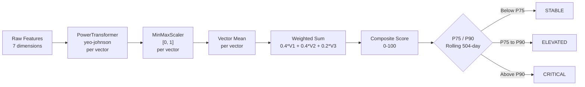
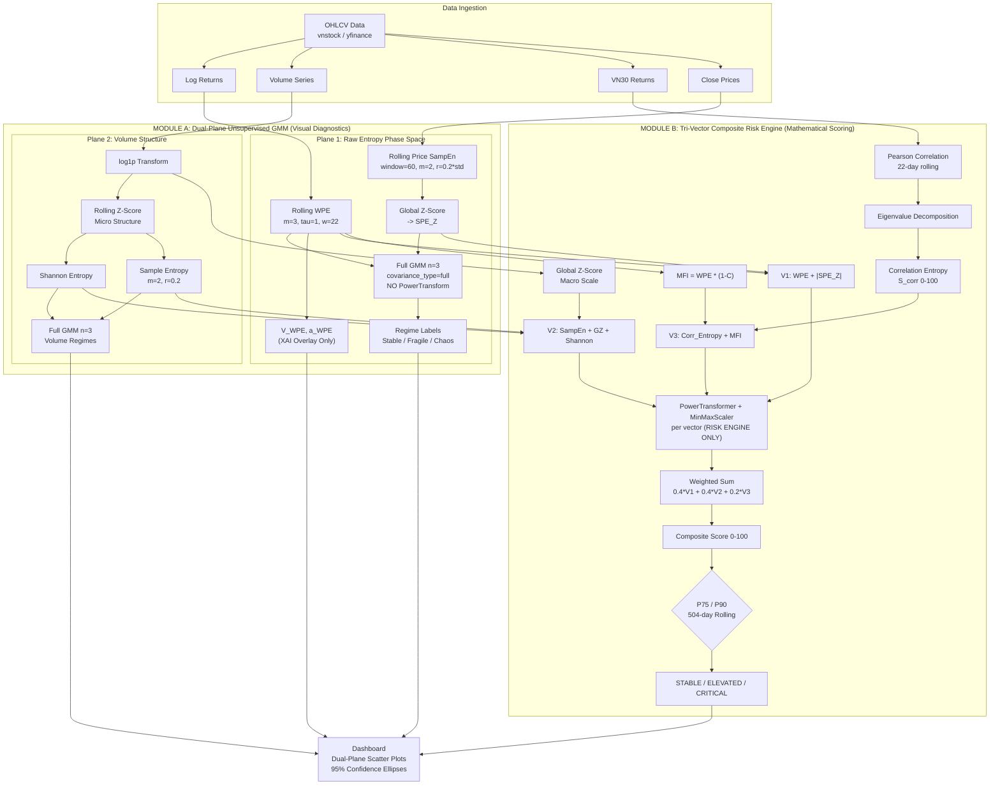

# ARCHITECTURE.md

## Financial Entropy Agent -- Technical Architecture Specification

**Version**: 4.0 (Raw Phase Space + XAI Decoupling)
**Classification**: Dual-Plane Unsupervised Diagnostics + Tri-Vector Composite Risk Engine

---

## Table of Contents

1. [The Great Purge (Deprecation Notice)](#1-the-great-purge)
2. [Conceptual Separation: Planes vs. Vectors](#2-conceptual-separation-planes-vs-vectors)
3. [Module A: Dual-Plane Unsupervised GMM Diagnostics](#3-module-a-dual-plane-unsupervised-gmm-diagnostics)
4. [Module B: Tri-Vector Composite Risk Engine](#4-module-b-tri-vector-composite-risk-engine)
5. [Dynamic Risk Management](#5-dynamic-risk-management)
6. [Agent Orchestrator](#6-agent-orchestrator)
7. [System Pipeline (Visual)](#7-system-pipeline)

---

## 1. The Great Purge

The following legacy components have been **permanently deprecated and removed** from the codebase:

| Deprecated Component | Description | Reason for Removal |
|:---|:---|:---|
| `v_streak` / `a_streak` | Velocity and acceleration streak counters | Heuristic; no statistical foundation |
| `5-day Fingerprint` | Sliding window binary feature vectors | Pattern-matching bias; not generalizable |
| `Historical Rhyme Matching` | Cosine/Euclidean similarity search | Data-snooping; overfitting to local history |
| `vstreak_library.pkl` | Local binary cache for pattern storage | Stateful artifact; violates statelessness |
| `IncrementalHybridMemory` | Local disk persistence layer | Replaced by stateless, on-the-fly computation |
| `WPE Sovereignty` | Hardcoded WPE thresholds (0.55, 0.80) | Human-imposed bias; replaced by GMM |
| `KDE Local Minima` | Kernel Density Estimation for WPE boundaries | Still a threshold heuristic; replaced by GMM |
| `Z-score + Sigmoid` | Composite risk normalization pipeline | Assumes normality; replaced by PowerTransformer |
| `Momentum_Entropy_Flux` | `sign(V) * sqrt(V^2 + a^2) * 100%` Y-axis | Too volatile; replaced by SPE_Z |
| `PowerTransformer (Plane 1)` | Yeo-Johnson on GMM input features | Destroys natural topology; removed from clustering |
| `covariance_type='tied'` | Shared covariance GMM | Replaced by `'full'` for free cluster geometry |
| `means_init` | Forced centroid initialization | Removed; GMM discovers centers autonomously |

**Design Principle**: The system operates as a **pure, stateless mathematical engine**. All metrics are computed on-the-fly from raw OHLCV data. No local binary storage, no historical caching, no human-imposed classification boundaries.

---

## 2. Conceptual Separation: Planes vs. Vectors

The system contains two **parallel, independent pipelines** that serve fundamentally different purposes.

| Concept | Definition | Count | Purpose |
|:---|:---|:---|:---|
| **Plane** | A 2D scatter plot where an Unsupervised GMM partitions data into visual clusters | **2** (Price, Volume) | Visual structural diagnostics; qualitative regime identification |
| **Vector** | A feature grouping fed into a mathematical formula for continuous risk scoring | **3** (V1, V2, V3) | Quantitative systemic risk measurement; automated 0-100 composite index |

**There is NO "Plane 3".** VN30 Cross-Sectional Breadth (Correlation Entropy, MFI) has no GMM classifier and no visual scatter plot. It exists exclusively as **Vector 3** within the Composite Risk Engine.

```
                    FINANCIAL ENTROPY AGENT
             =======================================

             [ RAW OHLCV & VN30 DATA ]
                        |
                        +-------------------------------------------------+
                        |                                                 |
           [ MODULE A: UNSUPERVISED GMM ]                [ MODULE B: COMPOSITE RISK ENGINE ]
           (Dual-Plane Visual Diagnostics)               (Tri-Vector Mathematical Synthesis)
                        |                                                 |
                  +-----+-----+                             +-------------+-------------+
                  |           |                             |             |             |
               PLANE 1     PLANE 2                      VECTOR 1      VECTOR 2      VECTOR 3
               (Price)     (Volume)                  (Price Phase)    (Volume)     (VN30 Breadth)
                  |           |                             |             |             |
              RAW WPE      Shannon                   WPE / |SPE_Z|   SampEn / GZ    CorrEnt / MFI
              RAW SPE_Z    SampEn                         |             |             |
                  |           |                           +-------------+-------------+
              Full GMM     Full GMM                                     |
             (3 Regimes)  (3 Regimes)                       PowerTransformer (Yeo-Johnson)
            (NO transform)                                              |
                                                                  MinMaxScaler [0, 1]
                  |                                                     |
          V_WPE, a_WPE                               Weighted Sum: 0.4*V1 + 0.4*V2 + 0.2*V3
          (XAI Overlay)                                                 |
                                                             Composite Risk Score (0-100)
                                                                        |
                                                             P75/P90 Rolling 504-day
                                                                        |
                                                          STABLE / ELEVATED / CRITICAL
```

---

## 3. Module A: Dual-Plane Unsupervised GMM Diagnostics

Module A provides **visual, qualitative proof** of structural state via two independent 2D phase spaces, each with its own GMM classifier.

### 3.1 Plane 1: Raw Entropy Phase Space (Price Structure)

#### 3.1.1 Feature Extraction

**X-Axis: Weighted Permutation Entropy (WPE) -- Structural Order**

$$H_{WPE} = -\frac{1}{\ln(m!)} \sum_{w} p_w \cdot \ln(p_w)$$

where $p_w$ are amplitude-weighted permutation probabilities, $m$ is the embedding dimension (default: 3), and the normalization factor $\ln(m!)$ constrains $H \in [0, 1]$.

- $H \to 0$: Perfectly ordered (deterministic trend)
- $H \to 1$: Maximum disorder (stochastic noise)

**Y-Axis: Standardized Price Sample Entropy (SPE_Z) -- Price Predictability**

$$SampEn(m, r, N) = -\ln\frac{A}{B}$$

where $A$ is the number of template matches of length $m+1$, $B$ is the number of template matches of length $m$, and $r = 0.2 \cdot \text{std}(\text{window})$ is the similarity threshold. Computed on a rolling window of 60 close prices.

The raw Sample Entropy is then Global Z-Score normalized:

$$SPE\_Z = \frac{SampEn - \mu_{all}}{\sigma_{all}}$$

- $SPE\_Z < 0$: Price evolution is more predictable/regular than average
- $SPE\_Z > 0$: Price evolution is more unpredictable/complex than average

**Why these two features are naturally orthogonal:**

| Property | WPE | SPE_Z |
|:---|:---|:---|
| Input data | Log-returns | Close prices |
| What it measures | Ordinal pattern disorder | Amplitude-based trajectory complexity |
| Sensitivity | Rank-order of values | Distance between values |
| Scale | Bounded [0, 1] | Z-score (unbounded) |

#### 3.1.2 Raw Full-Covariance GMM (No PowerTransform)

```python
GaussianMixture(
    n_components=3,
    covariance_type='full',   # Each cluster has its own 2x2 covariance matrix
    n_init=10,
    max_iter=500,
    # NO means_init -- GMM discovers centers autonomously
)
```

**Why NO PowerTransformer for Plane 1?**

The `PowerTransformer(yeo-johnson)` was previously applied to force the [WPE, SPE_Z] data into a Gaussian distribution before GMM fitting. However, this **destroys the natural topological boundaries** of the entropy metrics. Since SPE_Z is already a well-behaved Z-score and WPE is bounded [0,1], the Full-Covariance GMM can handle their different scales natively through its cluster-specific covariance matrices.

This design matches **Plane 2 (Volume)**, which also feeds raw features directly into Full-Covariance GMM.

**Label Assignment Protocol (Combined Entropy Sorting):**
```
1. Sum GMM centroid means: score_k = WPE_mean_k + SPE_Z_mean_k
2. Map: Lowest combined entropy  -> Stable (0)
        Middle combined entropy  -> Fragile (1)
        Highest combined entropy -> Chaos (2)
```

#### 3.1.3 Confidence Ellipses (95%)

With `covariance_type='full'`, each cluster has a **unique ellipse shape and orientation**:

```
For each cluster k:
    1. Extract covariance: Sigma_k = gmm.covariances_[k]  # Shape: (2, 2)
    2. Eigendecomposition: eigenvalues, eigenvectors = eigh(Sigma_k)
    3. Semi-axes: width = 2 * n_std * sqrt(lambda_1), height = 2 * n_std * sqrt(lambda_2)
    4. Rotation angle: theta = arctan2(eigenvectors[1,0], eigenvectors[0,0])
```

Unlike tied covariance (where all ellipses are identical shapes at different positions), full covariance produces ellipses with **different widths, heights, and rotations** -- revealing the true geometric structure of each regime.

#### 3.1.4 XAI Kinematic Trajectory Indicators (Decoupled)

Velocity and Acceleration of WPE are computed as **Explainable AI (XAI) overlay descriptors**. They are **NOT** fed into the GMM classifier or the Composite Risk Engine.

$$V_{WPE}(t) = WPE(t) - WPE(t-1)$$

$$a_{WPE}(t) = V_{WPE}(t) - V_{WPE}(t-1)$$

These indicators are injected into the LLM's system prompt to narrate the **direction and momentum** of entropy evolution:

| V_WPE | a_WPE | Interpretation |
|:---|:---|:---|
| > 0 | > 0 | Accelerating toward Chaos |
| > 0 | < 0 | Increasing but decelerating; stabilization ahead |
| < 0 | < 0 | Accelerating toward Stable |
| < 0 | > 0 | Decreasing but bottoming out |
| ~ 0 | ~ 0 | Stationary; no regime transition |

### 3.2 Plane 2: Volume Entropy Space (Liquidity Structure)

#### 3.2.1 Dual-Path Volume Processing

| Path | Metric | Scale | Purpose |
|:---|:---|:---|:---|
| **Macro** | `Vol_Global_Z` | Global Z-score of log(volume) | Absolute liquidity scale detection |
| **Micro** | `Vol_Rolling_Z` | Rolling Z-score (252-day) | Structural behavior baseline |

#### 3.2.2 Entropy Metrics (computed on Micro path)

- **Shannon Entropy** ($H_{Shannon}$): Histogram-based normalized entropy of rolling volume z-scores. Measures dispersion vs. concentration. $H \in [0, 1]$.

- **Sample Entropy** ($SampEn$): Template-matching complexity of the volume z-score series. Parameters: $m=2$, $r=0.2$. Higher values indicate structural irregularity.

#### 3.2.3 Full-Covariance GMM (Volume Regimes)

Plane 2 uses `GaussianMixture(n_components=3, covariance_type='full')` on `[Vol_Shannon, Vol_SampEn]`. Both planes now share the same methodology: raw features into Full-Covariance GMM.

Labels: Consensus Flow, Dispersed Flow, Erratic/Noisy Flow.

#### 3.2.4 Diagnostic Interpretation

| SampEn Level | Global Z | Interpretation |
|:---|:---|:---|
| Low | Negative | Institutional Accumulation (low entropy, below-average volume) |
| Low | Positive | Smart Money Distribution (ordered selling at scale) |
| High | Positive | Climax Distribution (peak FOMO, systemic fragility) |
| High | Negative | Capitulation Chaos (erratic behavior at low volume) |

---

## 4. Module B: Tri-Vector Composite Risk Engine

Module B is a **purely mathematical pipeline** that produces a continuous 0-100 systemic risk score. It has no visual scatter plots and no GMM classifiers. It consumes raw metrics from all three measurement domains (Price, Volume, VN30 Breadth) and synthesizes them into a single composite index.

**CRITICAL DESIGN NOTE:** PowerTransformer(yeo-johnson) is used **ONLY** in Module B for normalizing feature distributions before linear weighting. It is deliberately **excluded** from Module A (GMM clustering) to preserve natural topological boundaries.

### 4.1 Vector Definitions

| Vector | Weight | Raw Features | Source Domain |
|:---|:---|:---|:---|
| **V1** (Price Phase Space) | 0.40 | `WPE`, `abs(SPE_Z)` | Price OHLCV |
| **V2** (Liquidity Depth) | 0.40 | `Vol_SampEn`, `abs(Vol_Global_Z)`, `Vol_Shannon` | Volume series |
| **V3** (Structural Breadth) | 0.20 | `Corr_Entropy/100`, `MFI` | VN30 cross-section |

**Note:** V3 (VN30 Breadth) has **no visual Plane and no GMM classifier**. It is a raw feature vector fed directly into the composite scoring formula.

### 4.2 Metrics Exclusive to V3

#### 4.2.1 Correlation Entropy (EVD)

$$S_{corr} = -\frac{\sum_i p_i \cdot \ln(p_i)}{\ln(M)} \times 100$$

where $p_i = \frac{\lambda_i}{\sum_j \lambda_j}$ are the normalized eigenvalues of the VN30 Pearson correlation matrix, and $M$ is the number of stocks.

- $S_{corr} < 40$: Heavy-cap consensus (index driven by a few leaders)
- $S_{corr} > 70$: Structural fragmentation (broad-based selling/buying)

#### 4.2.2 Market Fragility Index (MFI)

$$MFI = WPE \times (1 - C_{JS})$$

where $C_{JS}$ is the Jensen-Shannon Statistical Complexity. MFI captures the interaction between disorder ($WPE$) and structural complexity ($C_{JS}$).

### 4.3 Preprocessing Pipeline



### 4.4 Data Leakage Prevention

Each vector's `PowerTransformer` and `MinMaxScaler` are fitted **exclusively** on the rolling 504-day historical window. The current day's features are then **transformed** (not fit-transformed) using these fitted objects.

```python
# Per-vector processing (simplified)
pt = PowerTransformer(method="yeo-johnson", standardize=True)
mms = MinMaxScaler(feature_range=(0, 1))

v_pt = pt.fit_transform(v_hist)       # Fit on 504-day history
v_scaled = mms.fit_transform(v_pt)    # Scale to [0,1]

c_pt = pt.transform(v_current)        # Transform current (NO fit)
c_scaled = mms.transform(c_pt)        # Scale using history params
```

---

## 5. Dynamic Risk Management

### 5.1 Rolling Window

The system uses a **504-day rolling window** (approximately 2 trading years) for all statistical calibrations:

- PowerTransformer fitting per vector (Module B only)
- MinMaxScaler fitting per vector (Module B only)
- Composite score percentile computation

**Rationale**: A 2-year window captures at least one full market cycle while ensuring the model adapts to macroeconomic regime changes and forgets outdated structural patterns.

### 5.2 Percentile Thresholds

| Threshold | Percentile | Risk Label | Interpretation |
|:---|:---|:---|:---|
| Below P75 | < 75th percentile | **STABLE** | Systemic coherence maintained |
| P75 to P90 | 75th - 90th percentile | **ELEVATED** | Structural divergence; monitoring required |
| Above P90 | > 90th percentile | **CRITICAL** | Phase transition zone; top-decile risk event |

These thresholds are **never hardcoded**. They are recomputed for every new data point based on the rolling 504-day composite score history.

### 5.3 Minimum Separation Guard

```python
if critical_bound - elevated_bound < 3.0:
    critical_bound = elevated_bound + 3.0
```

---

## 6. Agent Orchestrator

### 6.1 ReAct Protocol

```
1. fetch_market_data       -> Retrieve OHLCV (VNINDEX) + VN30
2. compute_entropy_metrics -> WPE, SPE_Z, MFI, V_WPE, a_WPE (XAI)
3. compute_volume_entropy  -> Shannon, SampEn, Global Z
4. predict_market_regime   -> Raw Full GMM Phase Space (Plane 1)
5. predict_volume_regime   -> Full GMM Volume Classification (Plane 2)
6. Synthesize              -> Tri-Vector Composite Risk Score (Module B)
7. Narrate                 -> Use V_WPE / a_WPE for XAI trajectory analysis
```

### 6.2 Reasoning Constraints

- Permitted: *"Entropy Phase Space"*, *"Phase Transition"*, *"Structural Order"*, *"Price Predictability"*, *"Systemic Coherence"*, *"Structural Divergence"*, *"Phase Space Classification"*, *"XAI Trajectory"*
- Forbidden: *"Support level"*, *"Resistance"*, *"Bollinger Bands"*, *"RSI"*, *"Moving Average"*, *"Overbought/Oversold"*, *"thresholds"*, *"cutoffs"*

---

## 7. System Pipeline



---

## Appendix: Dependency Matrix

| Module | File | Dependencies | Purpose |
|:---|:---|:---|:---|
| Data Skill | `skills/data_skill.py` | `vnstock`, `yfinance`, `pandas` | OHLCV retrieval |
| Quant Skill | `skills/quant_skill.py` | `numpy`, `numba`, `pandas` | WPE, SampEn (Price + Volume), Shannon, EVD, Kinematics |
| DS Skill | `skills/ds_skill.py` | `sklearn` (GMM, PowerTransformer), `scipy` | Raw Full GMM (Plane 1) + PowerTransform Volume GMM (Plane 2) |
| Orchestrator | `agent_orchestrator.py` | `anthropic`, `sklearn` (PowerTransformer, MinMaxScaler) | ReAct + Composite Risk (PowerTransform in risk engine only) |
| Dashboard | `dashboard.py` | `streamlit`, `plotly` | Dual-Plane visualization terminal |

---

*This document constitutes the complete technical specification of the Financial Entropy Agent v4.0 architecture. "Planes" refer exclusively to 2D visual GMM scatter plots (2 total). "Vectors" refer exclusively to feature groupings for the composite risk formula (3 total). These are parallel, independent pipelines. PowerTransformer is used ONLY in the Composite Risk Engine (Module B), never in GMM clustering (Module A).*
